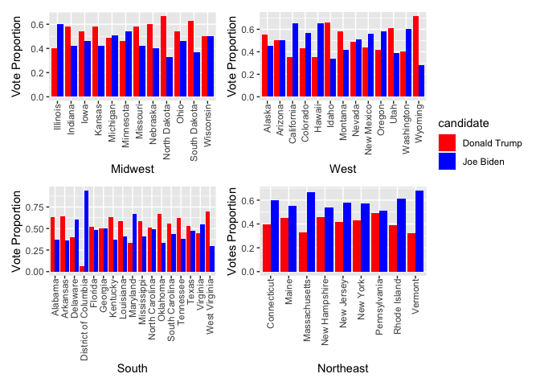
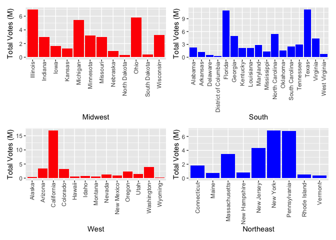
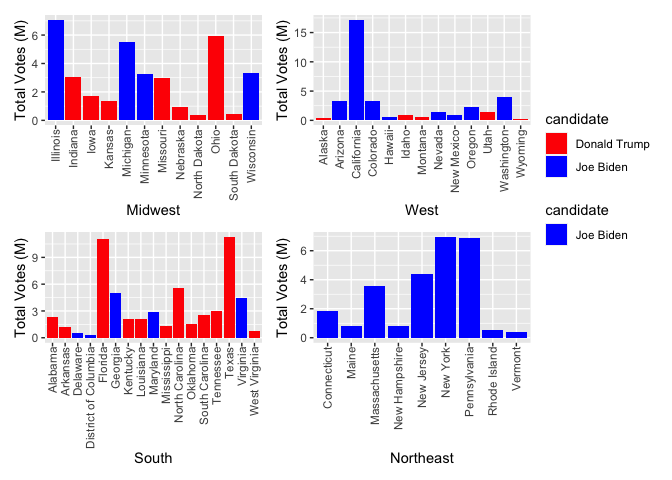
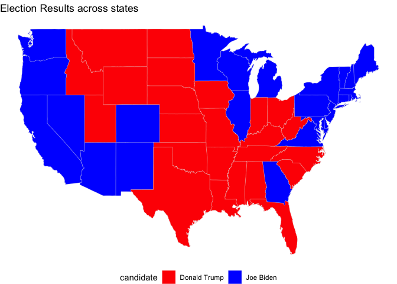

US Eleciton Result
================

## Import data

``` r
vote_df = read_csv("./datasets/president_county_candidate.csv")
state_sum = read_csv("./datasets/president_state.csv")
region_df = 
    read_csv("./datasets/states.csv") %>% 
    rename(state = State)  
```

## Merge Data and Tidy up the data

``` r
election_df =
    merge(
    read_csv("./datasets/president_county_candidate.csv"),
    read_csv("./datasets/president_state.csv"),
    all = TRUE
    ) %>% 
    group_by(state, candidate) %>% 
    summarise(
     state_votes = sum(total_votes)   
    ) %>% 
    filter(candidate == "Joe Biden" | candidate == "Donald Trump") %>% 
    group_by(state) %>% 
    mutate(state_subtotal = sum(state_votes))

election_by_region =
    merge(
        election_df, 
        region_df, 
        by = "state"
    )
```

## Plot the proportion of each candidate by states

``` r
colors <- c("red", "blue")
names(colors) = c("Donald Trump", "Joe Biden")

plot_1 =
election_by_region %>% 
    select(-`State Code`) %>% 
    mutate(prop_votes = round(state_votes / state_subtotal,2)) %>% 
    filter(Region == "Midwest") %>% 
    ggplot(aes(x = state, y = prop_votes, fill = candidate )) +
    geom_bar(stat = "identity", position = position_dodge()) + 
    labs(x = "Midwest", 
         y = "Vote Proportion") + 
    scale_fill_manual(values = colors) +
    theme(axis.text.x = element_text(angle = 90, vjust = 0.5, hjust = 1))

plot_2 =
    election_by_region %>% 
    select(-`State Code`) %>% 
    mutate(prop_votes = round(state_votes / state_subtotal,2)) %>% 
    filter(Region == "West") %>% 
    ggplot(aes(x = state, y = prop_votes, fill = candidate )) +
    geom_bar(stat = "identity", position = position_dodge()) +
    labs(x = "West", 
         y = "Vote Proportion") + 
    scale_fill_manual(values = colors) +
    theme(axis.text.x = element_text(angle = 90, vjust = 0.5, hjust = 1))

plot_3 =
    election_by_region %>% 
    select(-`State Code`) %>% 
    mutate(prop_votes = round(state_votes / state_subtotal,2)) %>%
    filter(Region == "South") %>% 
    ggplot(aes(x = state, y = prop_votes, fill = candidate )) +
    geom_bar(stat = "identity", position = position_dodge()) + 
     labs(x = "South", 
         y = "Vote Proportion") + 
    scale_fill_manual(values = colors) +
    theme(axis.text.x = element_text(angle = 90, vjust = 0.5, hjust = 1))
    
plot_4 =
    election_by_region %>% 
    select(-`State Code`) %>% 
    mutate(prop_votes = round(state_votes / state_subtotal,2)) %>%
    filter(Region == "Northeast") %>% 
    ggplot(aes(x = state, y = prop_votes,fill = candidate )) +
    geom_bar(stat = "identity", position = position_dodge()) + 
     labs(x = "Northeast",
         y = "Votes Proportion") + 
    scale_fill_manual(values = colors) +
    theme(axis.text.x = element_text(angle = 90, vjust = 0.5, hjust = 1))


par( mfrow = c(2,2) )
plot_1 + plot_2 + plot_3 + plot_4 + plot_layout(guides = "collect") 
```

<!-- -->

``` r
main_plot =
election_by_region %>% 
    select(-`State Code`) %>% 
    mutate(prop_votes = round(state_votes / state_subtotal,2)) %>% 
    ggplot(aes(x = Region, y = prop_votes, fill = candidate )) +
    geom_bar(stat = "identity", position = position_dodge()) + 
    labs(title = "Proportion of Votes in Four Main Regions", 
         x = "Region", 
         y = "Vote Proportion") + 
    scale_fill_manual(values = colors)
    theme(axis.text.x = element_text(angle = 90, vjust = 0.5, hjust = 1))
```

    ## List of 1
    ##  $ axis.text.x:List of 11
    ##   ..$ family       : NULL
    ##   ..$ face         : NULL
    ##   ..$ colour       : NULL
    ##   ..$ size         : NULL
    ##   ..$ hjust        : num 1
    ##   ..$ vjust        : num 0.5
    ##   ..$ angle        : num 90
    ##   ..$ lineheight   : NULL
    ##   ..$ margin       : NULL
    ##   ..$ debug        : NULL
    ##   ..$ inherit.blank: logi FALSE
    ##   ..- attr(*, "class")= chr [1:2] "element_text" "element"
    ##  - attr(*, "class")= chr [1:2] "theme" "gg"
    ##  - attr(*, "complete")= logi FALSE
    ##  - attr(*, "validate")= logi TRUE

``` r
ggplotly(main_plot)    
```

## Bar Plot of total votes in Each State segamented by Region

``` r
options(scipen = 999)

total_votes_p1 =
    election_by_region %>% 
    select(-`State Code`) %>% 
    filter(Region == "Midwest") %>% 
    ggplot(aes(x = state, y = state_subtotal/1000000)) +
    geom_bar(stat = "identity", position = position_dodge(), fill = "red") +
    labs( 
        x = "Midwest", 
        y = "Total Votes (M)"
    ) +
    theme(axis.text.x = element_text(angle = 90, vjust = 0.5, hjust = 1)) 

total_votes_p2 =
    election_by_region %>% 
    select(-`State Code`) %>% 
    filter(Region == "South") %>% 
    ggplot(aes(x = state, y = state_subtotal/1000000)) +
    geom_bar(stat = "identity", position = position_dodge(), fill = "blue") +
    labs(
        x = "South", 
        y = "Total Votes (M)"
    ) +
    theme(axis.text.x = element_text(angle = 90, vjust = 0.5, hjust = 1)) 

total_votes_p3 =
    election_by_region %>% 
    select(-`State Code`) %>% 
    filter(Region == "West") %>% 
    ggplot(aes(x = state, y = state_subtotal/1000000)) +
    geom_bar(stat = "identity", position = position_dodge(), fill = "red") +
    labs(
        x = "West", 
        y = "Total Votes (M)"
    ) +
    theme(axis.text.x = element_text(angle = 90, vjust = 0.5, hjust = 1)) 

total_votes_p4 =
    election_by_region %>% 
    select(-`State Code`) %>% 
    filter(Region == "Northeast") %>% 
    ggplot(aes(x = state, y = state_subtotal/1000000)) +
    geom_bar(stat = "identity", position = position_dodge(), fill = "blue") +
    labs(
        x = "Northeast", 
        y = "Total Votes (M)"
    ) +
    theme(axis.text.x = element_text(angle = 90, vjust = 0.5, hjust = 1)) 

par( mfrow = c(2,2) )
total_votes_p1 + total_votes_p2 + total_votes_p3 + total_votes_p4
```

<!-- -->

## Clean Data Specifying Winner

``` r
election_winner_df =
   read_csv("./datasets/president_county_candidate.csv") %>% 
    group_by(state, party) %>% 
    mutate(party_total = sum(total_votes)) %>% 
    ungroup() %>% 
    group_by(state) %>%
    mutate(state_winner = case_when(
        party_total == max(party_total) ~ TRUE,
        party_total != max(party_total) ~ FALSE),
        state_total = sum(total_votes)
    )

winner_region =
    left_join(election_winner_df, region_df) %>% 
    filter(state_winner == TRUE) %>% 
    select(state, candidate, state_total, Region) %>% 
    distinct()
```

## Barplot for each states by 4 regions specifying winner

``` r
colors <- c("red", "blue")
names(colors) = c("Donald Trump", "Joe Biden")

Midwest_votes_p =
    winner_region %>% 
        filter(Region == "Midwest") %>% 
        ggplot(aes(x = state, y = state_total/1000000, fill = candidate)) +
        geom_bar(stat = "identity", position = position_dodge()) +
        labs( 
            x = "Midwest", 
            y = "Total Votes (M)"
        ) +
         scale_fill_manual(values = colors) +
        theme(axis.text.x = element_text(angle = 90, vjust = 0.5, hjust = 1)) 

West_votes_p =
    winner_region %>% 
        filter(Region == "West") %>% 
        ggplot(aes(x = state, y = state_total/1000000, fill = candidate)) +
        geom_bar(stat = "identity", position = position_dodge()) +
        labs( 
            x = "West", 
            y = "Total Votes (M)"
        ) +
         scale_fill_manual(values = colors) +
        theme(axis.text.x = element_text(angle = 90, vjust = 0.5, hjust = 1)) 

South_votes_p =
    winner_region %>% 
        filter(Region == "South") %>% 
        ggplot(aes(x = state, y = state_total/1000000, fill = candidate)) +
        geom_bar(stat = "identity", position = position_dodge()) +
        labs( 
            x = "South", 
            y = "Total Votes (M)"
        ) +
         scale_fill_manual(values = colors) +
        theme(axis.text.x = element_text(angle = 90, vjust = 0.5, hjust = 1)) 


Northeast_votes_p =
    winner_region %>% 
        filter(Region == "Northeast") %>% 
        ggplot(aes(x = state, y = state_total/1000000, fill = candidate)) +
        geom_bar(stat = "identity", position = position_dodge()) +
        labs( 
            x = "Northeast", 
            y = "Total Votes (M)"
        ) +
         scale_fill_manual(values = colors) +
        theme(axis.text.x = element_text(angle = 90, vjust = 0.5, hjust = 1)) 

Midwest_votes_p + West_votes_p + South_votes_p + Northeast_votes_p + plot_layout(guides = "collect") 
```

<!-- -->

## Tidy Data with Map information.

``` r
election_map_df =
    election_winner_df %>% 
    filter(state_winner == TRUE) %>% 
    mutate(region = tolower(state)) %>% 
    select(state, candidate, party_total, state_total, region) %>% 
    distinct()

usa_map = map_data("state") 

usa_election_map = left_join(usa_map, election_map_df)
```

## Plot the map with the election result.

``` r
colors <- c("red", "blue")
names(colors) = c("Donald Trump", "Joe Biden")

election_result_map =
ggplot(data = usa_election_map,
       aes(x = long, y = lat,
           group = group, fill = candidate)) +
    geom_polygon(color = "gray90", size = 0.1) +
    labs(title = "Election Results across states") + 
    scale_fill_manual(values = colors) +
    theme_void() +
    theme(
        axis.title.x = element_blank(),
        axis.text.x = element_blank(),
        axis.ticks.x = element_blank(), 
        axis.title.y = element_blank(),
        axis.text.y = element_blank(),
        axis.ticks.y = element_blank(), 
        legend.position = "bottom") 
election_result_map
```

<!-- -->

``` r
ggplotly(election_result_map)
```
